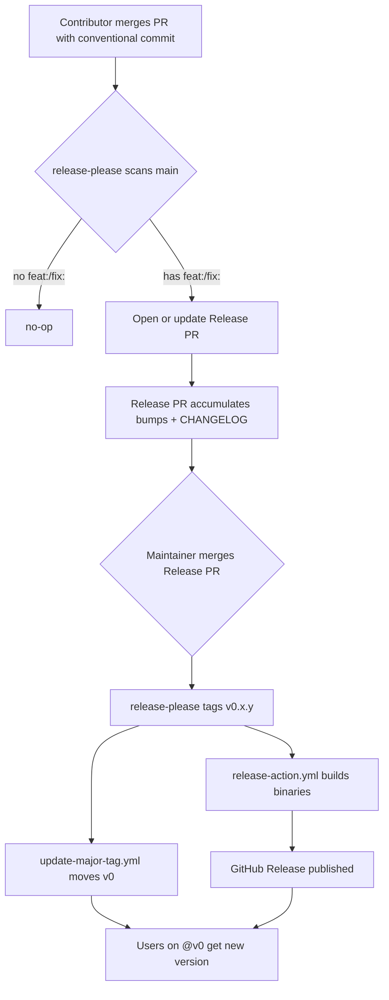
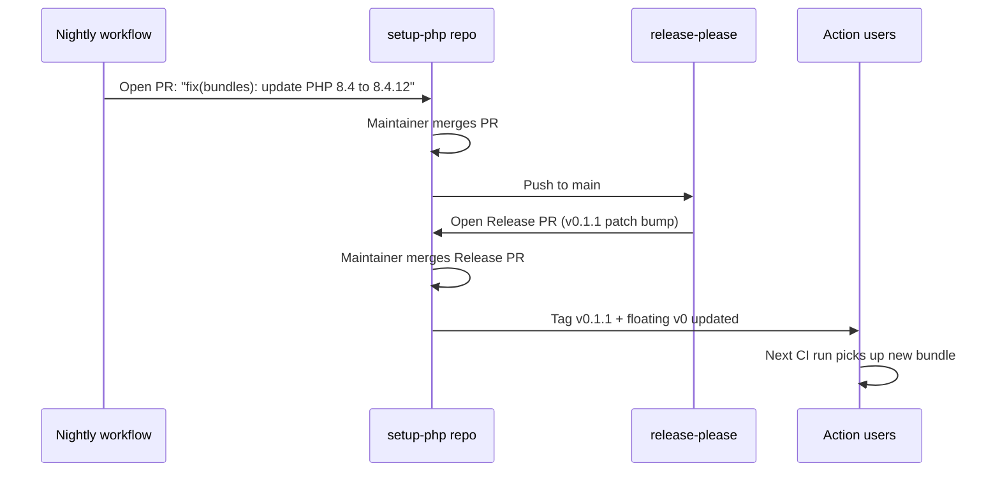
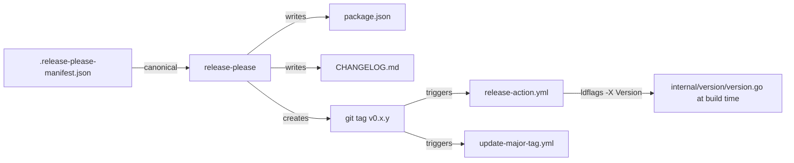

# Release Process

`buildrush/setup-php` uses [`release-please`](https://github.com/googleapis/release-please) to derive versions from [Conventional Commits](https://www.conventionalcommits.org/), maintain `CHANGELOG.md`, and cut tagged GitHub Releases. Releases are human-gated: release-please opens a Release PR on `main` that accumulates pending changes, and merging it cuts the version.

This document covers the workflow for contributors, maintainers, and users of the action.

---

## Overview



Three workflows cooperate:

| Workflow | Trigger | Responsibility |
|---|---|---|
| `release-please.yml` | `push: main` | Opens/updates the Release PR; creates the tag when merged |
| `release-action.yml` | `push: tags v*` | Builds `phpup` and `planner` binaries; attaches to the GitHub Release |
| `update-major-tag.yml` | `push: tags v*.*.*` | Force-moves the floating `v0` tag (skips prereleases) |

---

## For Contributors

Every commit on `main` must be a [Conventional Commit](https://www.conventionalcommits.org/). The `type` determines the version bump release-please will propose.

| Commit type | Example | Pre-1.0 bump | Post-1.0 bump |
|---|---|---|---|
| `feat:` | `feat: add xdebug coverage support` | minor (`0.1.0` → `0.2.0`) | minor |
| `fix:` | `fix: handle missing lockfile entry` | patch (`0.1.0` → `0.1.1`) | patch |
| `fix(bundles):` | `fix(bundles): update PHP 8.4 to 8.4.12` | patch | patch |
| `perf:` | `perf: cache GHCR manifests locally` | patch | patch |
| `feat!:` / `BREAKING CHANGE:` | `feat!: drop Node 16 support` | minor (not 1.0 — see config) | major |
| `docs:` / `chore:` / `refactor:` / `test:` | `chore: bump golangci-lint` | none | none |

### Breaking changes

Add `!` after the type or a `BREAKING CHANGE:` footer:

```
feat!: rename `php-version-file` input to `version-file`

BREAKING CHANGE: the input `php-version-file` has been renamed. Update
your workflows to use `version-file` instead.
```

Pre-1.0 this still bumps the minor (`0.1.0` → `0.2.0`). After `v1.0.0` it will bump the major.

### Bundle lockfile refreshes

Automated bundle-refresh PRs (nightly promotions of `latest-*` bundles) must use `fix(bundles): <description>`. This guarantees a patch bump and keeps the CHANGELOG honest about what consumers actually receive.

---

## For Maintainers

### Reviewing the Release PR

release-please opens a single Release PR (titled `chore(main): release <version>`) and keeps it updated as new commits land. Before merging, verify:

1. **Proposed version matches expectations.** A single `feat:` since the last tag should produce a minor bump; only `fix:` should produce a patch.
2. **CHANGELOG entries are accurate.** Grouped under the right section (Features, Bug Fixes, etc.). Commit subjects render cleanly.
3. **`.release-please-manifest.json` advanced.** It is the canonical source of truth.
4. **`package.json` version matches the manifest.**
5. **CI is green** on the Release PR branch.

Merging the Release PR (as a merge commit — do not squash) causes release-please to:

- Create the `vX.Y.Z` git tag on the merge commit
- Publish a GitHub Release using `CHANGELOG.md` content as the body

The tag push then triggers two further workflows in parallel:

- `release-action.yml` builds the Go binaries and attaches them to the GitHub Release
- `update-major-tag.yml` force-moves `v0` to the new tag

### Cutting the first release

The manifest starts at `0.0.0`. As soon as the first conventional commit with a releasable type (`feat:` or `fix:`) lands on `main`, release-please opens a Release PR proposing `v0.1.0`. Merge it to produce the project's first tagged release.

### Rolling back a bad release

Never delete a published tag — users may already have pinned it. Instead:

1. Land a `fix:` commit with the revert
2. Merge the next Release PR to cut a superseding patch (e.g., `v0.1.2` after a broken `v0.1.1`)
3. `update-major-tag.yml` moves `v0` forward automatically

Only delete a tag if it was created in error and has not been consumed by any public workflow run.

---

## For Action Consumers

Three ways to pin `buildrush/setup-php` in your workflow:

```yaml
# Floating major — latest 0.x.y (pre-1.0: may include breaking changes in minor bumps!)
- uses: buildrush/setup-php@v0

# Exact version — fully reproducible
- uses: buildrush/setup-php@v0.1.0

# Pinned SHA — most reproducible and audit-friendly
- uses: buildrush/setup-php@<40-char-sha>
```

### Pre-1.0 stability

While the action is in the `0.x` range, semver permits breaking changes in minor bumps. Pinning `@v0` means you opt into potential breaking changes with every minor release.

For production workflows before `v1.0.0`, prefer pinning to an exact version (`@v0.1.0`) or a SHA. After `v1.0.0` ships (targeted post-Phase-7; see `docs/superpowers/specs/2026-04-16-phased-implementation-design.md`), `@v1` will be safe to pin — minor bumps will be non-breaking by convention.

---

## Bundle Refresh Flow

Bundle refreshes (e.g., PHP 8.4.11 → 8.4.12) are the most common source of releases and always produce patch bumps.



Because the bundle lockfile is embedded into `phpup` at build time, every bundle refresh produces a new binary and therefore a new action version. This is deliberate: it guarantees that pinning `@v0.1.0` gives byte-identical PHP environments forever, and pinning `@v0` gives the most current bundle set.

---

## Version Source-of-Truth



The manifest is the only version that humans maintain (via release-please). `package.json` and `CHANGELOG.md` are written by release-please. `internal/version/version.go` stays at `"dev"` in source; the real version is injected at build time from `$GITHUB_REF_NAME` via `-ldflags -X`.

---

## Version Policy

- While `0.x.y`:
  - `feat:` → minor bump (new phase, new capability)
  - `fix:` → patch bump (bundle refresh, bug fix)
  - `feat!:` / `BREAKING CHANGE:` → minor bump (does not jump to 1.0 automatically)
- `v1.0.0` is cut manually after Phase 7 completes (see the phased implementation spec). At that point:
  - Maintainers set the manifest to `1.0.0` via a `Release-As: 1.0.0` commit trailer, or
  - Drop `bump-minor-pre-major` from the config so the next breaking change produces `v1.0.0`

After `v1.0.0`, standard semver applies: `feat!:` → major, `feat:` → minor, `fix:` → patch.

---

## Troubleshooting

**Release PR doesn't open.** Check that the commit types on `main` since the last tag include at least one `feat:`, `fix:`, `perf:`, or `revert:`. Pure `chore:` / `docs:` / `refactor:` / `test:` histories produce no Release PR by design.

**Release PR proposes the wrong version.** Inspect the commits since the last tag — a stray `feat:` or `BREAKING CHANGE:` footer can shift the bump. Correct the commit history with a new `fix:` commit rather than force-pushing to `main`.

**Tag created but no GitHub Release.** release-please creates both the tag and the Release in the same step. If the Release is missing, check the `release-please` workflow run logs — the GitHub token permission `contents: write` is required and set at the workflow level.

**`v0` tag did not move.** Check the `update-major-tag.yml` run for the new tag. The workflow explicitly skips prerelease tags (`v*.*.*-*`); release tags should always move it.

**Binary artifacts missing from the GitHub Release.** These are produced by `release-action.yml`, not release-please. Check that workflow's run for the `v*` tag. The two workflows are independent on purpose — a failure in one does not block the other.
